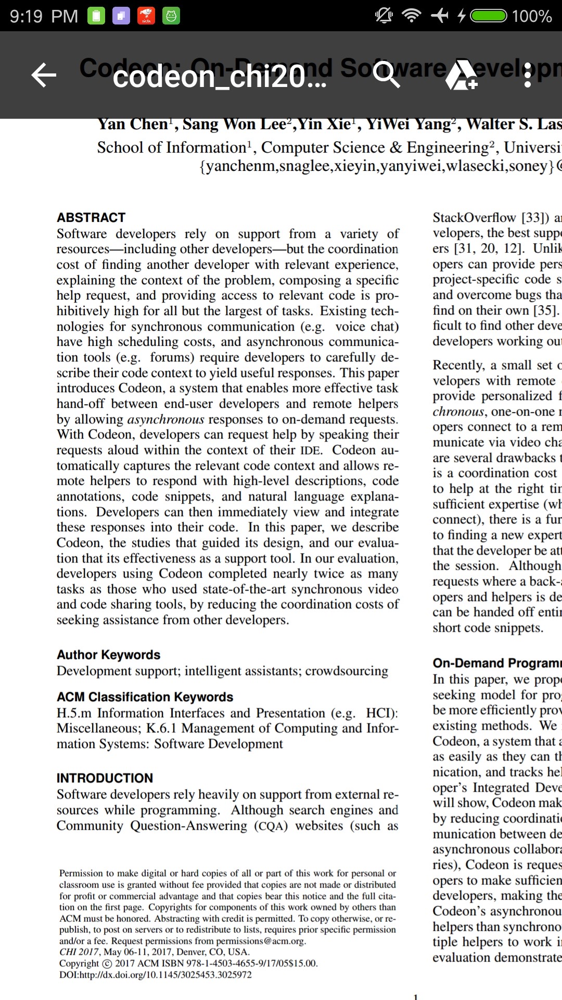
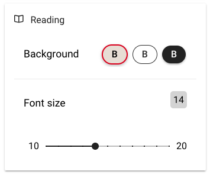

# Paper Reader on Mobile Phones

## Introduction

Ever experienced reading research papers on your phone? It sucked, right? The phone screens are just too small for those magnificant pdf documents people worked so hard to format.

With this app, you could just put in the link to the paper you want to read, wait a little while for the app to parse the pdf document using some advanced text extraction algorithms from [indico](indico.com), and then read the paper like you are reading a normal article on your phone screen. To illustrate, you just went from ***this***:

to **this**:

And of course, it comes in with the ability to adjust the font size and the background:

## Questions

I appreciate any suggestions! If you want a particular feature, please feel free to create an issue, and I'll address it ASAP!

## Author

- [Xieyang (Michael) Liu](https://lxieyang.github.io)     [Ph.D. student @ Carnegie Mellon University]