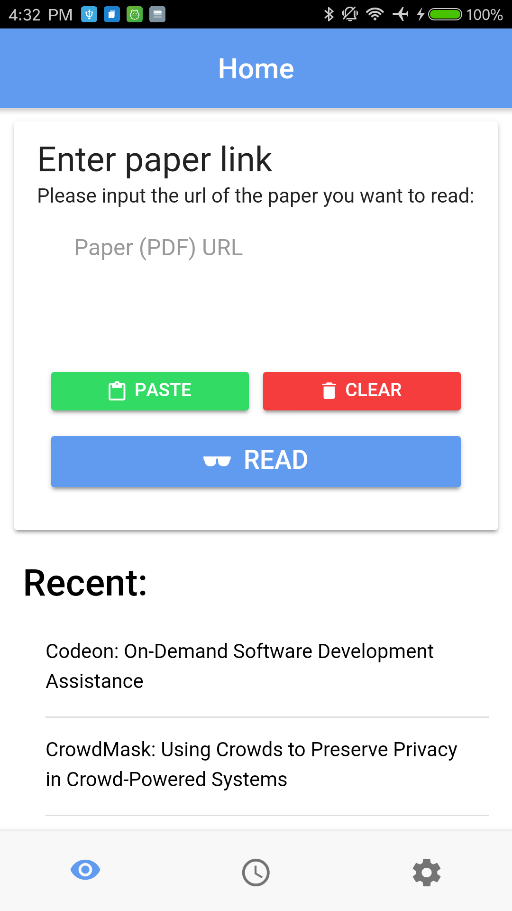
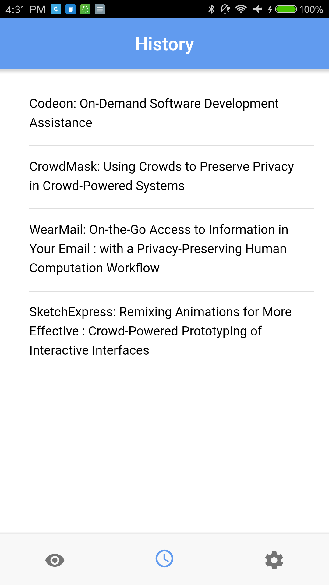
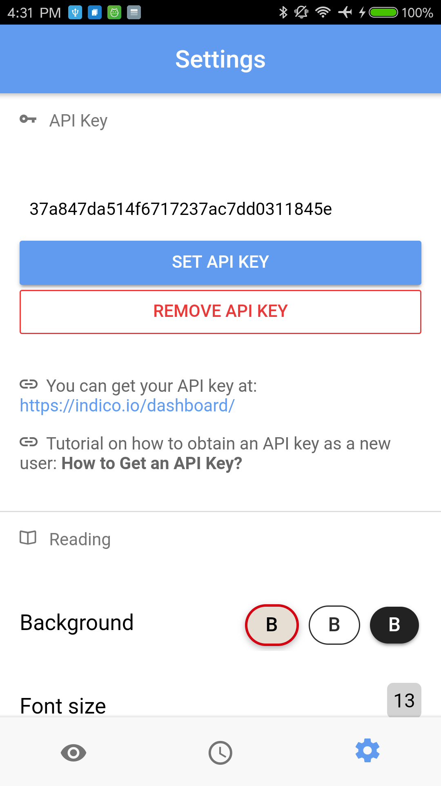
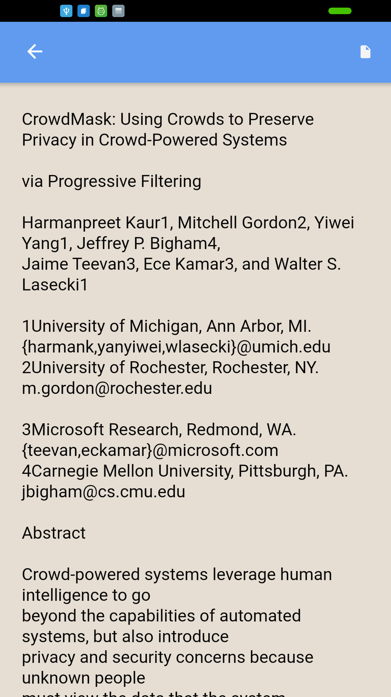
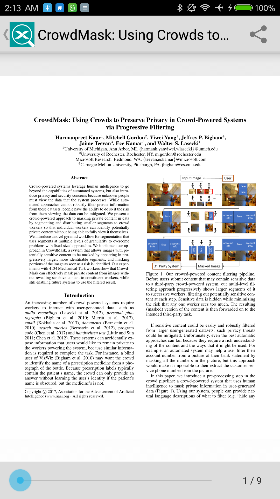
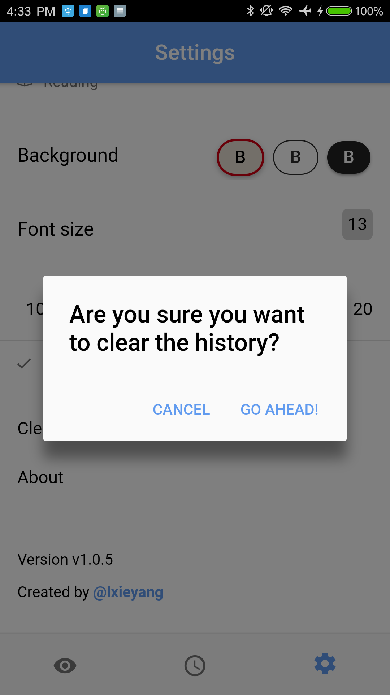

# Paper Reader on Mobile Phones

## Introduction

Ever experienced reading research papers on your phone? It sucked, right? The phone screens are just too small for those magnificant pdf documents people worked so hard to format.

With this app, you could just put in the link to the paper you want to read, wait a little while for the app to parse the pdf document using some advanced text extraction algorithms from [indico](indico.com), and then read the paper like you are reading a normal article on your phone screen. To illustrate, you just went from ***this***:

to **this**:

And of course, it comes in with the ability to adjust the font size and the background:

## Demo
Here's a demo of how to basically use this app:

## News & Updates
- Jan 21, 2018 (v1.0.7): Added support for viewing the original pdf document!
- Jan 5, 2018 (v1.0.6): Added support for deleting individual document.
- Dec 19, 2017 (v1.0.5): Refactor code for better performance and UX. (Using ***Rx.ReplaySubject***)
- Dec 8, 2017 (v1.0.4): Add ***paste from clipboard*** support.
- Nov 21, 2017 (v1.0.3): 
  - Updated the app to be **tab-based** instead of the original sidebar-based.
  - Added a **history** tab showing all previously viewed documents, as well as ability to clear the history.
  - Added preliminary paper title analysis and display support in the history tab for better identification.
- Sept 30, 2017 (v1.0.2): Indico engineers agreed to make changes to their APIs in order to support better image extraction and presentation. Excited! Will try to incorporate this change as soon as the new features are pushed!
- Sept 29, 2017 (v1.0.1): Now you are able to view recently-visited documents without additional web requests. It's all stored in the app!
- Sept 18, 2017 (v1.0.0): App released! Excited!

## Up-to-date Screenshots:

     

## Technologies

- [Indico](https://indico.io)'s `pdf_extraction` API is used to extract all the texts from a PDF file.
- This app is written using the [Ionic Framwork](https://ionicframework.com).

## Installation

You want to follow these general steps to install the app to your device:

- Install `Node.js`
- Install `Ionic`
- Clone the this repo
- For iOS users: Make sure you have a Mac. Run `ionic cordova build ios --prod` in the terminal. Open up the compiled project in Xcode, then install it to your phone.
- For Android users: Connect your phone to your computer. Make sure USB debugging is on. Run `ionic cordova build android --prod` in the terminal. This will install the app to your phone after you give it permission on your device.

## Future work

- I plan to add a tab that shows all the history documents that you visited.
- I plan to better parse the text information to automatically extract ***title***, ***author***, ***subtitle*** information out. This will also lead to a better visual presentation of the text information.
- I plan to work with [Indico](https://indico.io) engineers to extract images from pdf document, as the current implementation does not present images from the original document. 

## Questions

I appreciate any suggestions! If you want a particular feature, please feel free to create an issue, and I'll address it ASAP!

## Author

- [Xieyang (Michael) Liu](https://lxieyang.github.io)     [Ph.D. student @ Carnegie Mellon University]